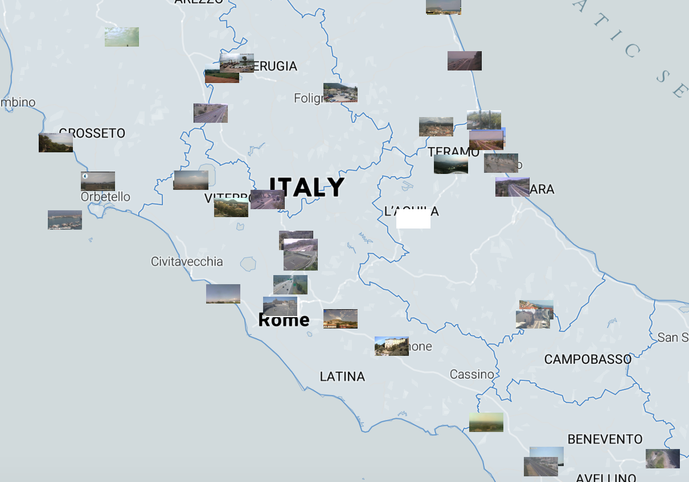

# SEI Project 2 - Digital Nomad Hub
Retrieves a map of locations of potential destination for digitals nomads using live streaming webcams.
See the website online at http://digital-nomad-ga.herokuapp.com/
​


### Timeframe & Team
> 48h, pair programming

### The Brief
Build a React application that consumes a public API.
Have several components - At least one classical and one functional.
The app should include a router - with several "pages".
Have semantically clean HTML.
Be deployed online and accessible to the public.
Work in pairs.
​
### Technologies
* React
* Axios
* Insomnia
* Webpack
* HTML5
* CSS
* Bulma
* Teletype
* Heroku

### Deployment
The website is deployed on Heroku and it can be found here: http://digital-nomad-ga.herokuapp.com/
___

## Website Summary
Digital Nomad Hub was the second project during the General Assembly Software Engineering Immersive course (Week 5). The project was made in collaboration with Katarzyna https://github.com/kasiaaguti.

We had to render an app that retrieves data from a public API in an interesting and engaging manner. We had just under 48 hours to achieve this goal, making it extremely time-sensitive. We chose to create a web app called Digital Nomad Hub, which allows users to retrieve a map of locations of potential destination for digitals nomads, using the Mapbox and Rapid webcams APIs.

My part in the project included creating a Mapbox API integration, display the results on the map and general styling of the map.

___
## Approach
As this was a pair coded 'reactathon' with a very limited timeframe, we chose was to focus on functionality. For styling we used Bulma which was very helpful.
Most of our coding was done on one laptop, so we discussed each piece of code and the best approaches. We also used the Teletype team coding tool.

### Process
The core idea was to used Webcamstravel API https://webcamstravel.p.rapidapi.com/ and render it on a map (for which we used Mapbox). Webcam API gave us access to public cameras from all over the world. We used geographic coordinates to show markers of the camera's locations on the map. After an user clicks a marker in desired location a popup appears showing more details. User can click on the camera image to see a live view from this particular camera in a new window.

## Visuals

**First render of a map**
<br />


**More cameras for a clicked location**
<br />


**Pop up on a clicked marker**
<br />


**Rendering first set of markers**
```
this.markers.forEach(marker => marker.remove())
this.markers = this.props.markers.map(point => {
  // create custom popups one for each marker
  const el = document.createElement('div')
  el.className = 'marker'
  el.style.backgroundImage = 'url(' + point.image.current.preview + ')'
```
**Accessing a set of webcams after user clicks on particular location**
```
getWebcamList(lat, lng) {
  axios.get(`https://webcamstravel.p.rapidapi.com/webcams/list/nearby=${lat},${lng},250/limit=50?show=webcams:image,location,player`,
    { headers: {
      'X-RapidAPI-H': 'webcamstravel.p.rapidapi.com',
      'X-RapidAPI-Key': rapidApiKey
    }
    })
    .then(res => {
      this.setState({ points: res.data.result.webcams}, () => console.log(this.state.points))
    })
    .catch(err => console.log(err))
}
```

### Challenges and Wins
Webcamstravel allows to access just fifty cameras at the same time. We decided at the first render to show 50 most popular cameras in the world. Then fifty most popular in the 200km radius from the place where a user clicks.

___
 ## Future Improvements
 - We might work more on user experience regarding popups and redirecting to webcams
 - Replace the external Indeed website job search link with an API
